# Customer Intelligence Platform
## Production-Grade Behavioral Analytics on Commodity Hardware

[](https://www.python.org/)
[](https://duckdb.org/)
[](https://www.pola.rs/)
[](https://streamlit.io/)
[](LICENSE)

> **An end-to-end data science platform demonstrating that 109M+ event streams can be processed, modeled, and analyzed on a single 16GB RAM machine through intelligent optimization and modern OLAP architecture.**

---

## Table of Contents
- [Executive Summary](#executive-summary)
- [Problem Statement](#problem-statement)
- [System Architecture](#system-architecture)
- [Data Pipeline & Optimizations](#data-pipeline--optimizations)
- [Feature Engineering](#feature-engineering)
- [Machine Learning](#machine-learning)
- [Results & Business Impact](#results--business-impact)
- [Technical Implementation](#technical-implementation)
- [Dashboard & Visualization](#dashboard--visualization)
- [Installation & Usage](#installation--usage)
- [Project Structure](#project-structure)
- [Limitations & Future Work](#limitations--future-work)

---

## Executive Summary

This platform transforms **109.9 million e-commerce events** (14.7 GB raw CSV) into actionable business intelligence using a single-node architecture optimized for commodity hardware. By leveraging columnar storage (DuckDB), lazy evaluation (Polars), and dimensional modeling, the system achieves:

| Metric | Achievement |
|--------|-------------|
| **Data Compression** | 14.7 GB → 1.9 GB (**87% reduction**) |
| **In-Memory Footprint** | 3.7 GB (fits comfortably in 16 GB RAM) |
| **Query Latency** | <1 second average on 109M rows |
| **ML Model Lift** | **4.5x** over baseline (36% vs 8% conversion) |
| **Dataset Volume** | 109,950,743 events, 5.3M users, 206K products |
| **Processing Time** | ~16 minutes end-to-end on consumer hardware |

**Key Innovation:** Demonstrates that advanced behavioral analytics, machine learning, and experimentation frameworks **do not require distributed computing** for datasets in the 100M-500M row range when proper optimization techniques are applied.

---

## Problem Statement

### Industry Context
E-commerce platforms generate massive event streams (views, carts, purchases) that contain valuable signals for personalization, churn prediction, and revenue optimization. However, traditional approaches face critical limitations:

#### ❌ The Status Quo
1. **Rule-Based Reporting**: Limited to retrospective "what happened" analysis without predictive capabilities
2. **Infrastructure Bloat**: Default assumption that 100M+ rows require Spark/Databricks clusters ($$$)
3. **Analysis Paralysis**: Data scientists spend 80% of time on ETL instead of modeling
4. **Vendor Lock-In**: Cloud data warehouses (Snowflake, BigQuery) create recurring costs

#### ✅ This Platform's Approach
- **Single-Node Efficiency**: Processes 109M rows on 16GB RAM through memory optimization
- **Predictive Analytics**: Propensity models, recommendation engines, and A/B testing frameworks
- **Sub-Second Latency**: OLAP queries return in <1s via DuckDB and dimensional modeling
- **Local-First**: Run entire stack locally or deploy to free tier cloud services

---

## System Architecture

The platform implements a **modern ELT (Extract-Load-Transform) pipeline** optimized for analytical workloads on constrained hardware.



### Architecture Layers

| Layer | Technology | Purpose | Optimization Technique |
|-------|-----------|---------|----------------------|
| **Ingestion** | Polars 0.20 | Streaming CSV → Parquet conversion | Lazy evaluation, type downcasting (Int64→Int32) |
| **Storage** | DuckDB + Parquet | Columnar OLAP database | ZSTD Level 3 compression, memory-mapped I/O |
| **Data Model** | Star Schema | Dimensional modeling for analytics | Pre-aggregated fact tables (`fact_daily_kpis`, `fact_sessions`) |
| **ML Pipeline** | LightGBM + SciPy | Gradient boosting & statistical inference | Histogram-based splits, categorical feature handling |
| **Serving** | Streamlit + Plotly | Interactive dashboard | Cached connections, vectorized Plotly rendering |

### Data Flow

```
Raw CSVs (14.7 GB)
    ↓ [Polars: Type optimization + Categorical encoding]
Optimized Parquet (1.9 GB, 87% reduction)
    ↓ [DuckDB: In-memory ingestion]
Star Schema (dim_users, dim_products, fact_sessions)
    ↓ [SQL feature engineering]
ML-Ready Features (RFM scores, session metrics, temporal splits)
    ↓ [LightGBM training]
Predictions & Insights
    ↓ [Streamlit dashboard]
Interactive Analytics
```

---

## Data Pipeline & Optimizations

### Dataset Characteristics

**Source**: [Kaggle - eCommerce Behavior Data](https://www.kaggle.com/datasets/mkechinov/ecommerce-behavior-data-from-multi-category-store)  
**Time Period**: October - November 2019  
**Preprocessing**: Located in [`summarise/`](summarise/) directory

| Attribute | Value |
|-----------|-------|
| **Total Events** | 109,950,743 |
| **Unique Users** | 5,333,743 |
| **Unique Products** | 206,134 |
| **Event Types** | `view`, `cart`, `remove_from_cart`, `purchase` |
| **Date Range** | 2019-10-01 to 2019-11-30 (61 days) |
| **Conversion Rate** | 1.6% (highly imbalanced) |
| **Missing Data** | 35-42% in `category_code`, `brand` (handled via COALESCE) |

### Critical Optimization: Memory Footprint Reduction

#### Raw CSV Analysis
```
2019-Oct.csv:  5.67 GB  (67M rows)
2019-Nov.csv:  9.01 GB  (42M rows)
──────────────────────────────
Total:        14.68 GB (109M rows)
```

#### Naive Pandas Approach (FAILED) 
```python
df = pd.read_csv("2019-Oct-Nov.csv")  # Attempts to load entire dataset
# Result: MemoryError on 16GB RAM
# Estimated requirement: 120+ GB (8 bytes/float × 9 cols × 109M rows + overhead)
```

#### Optimized Polars Approach (SUCCESS) 

**Key Techniques Implemented** ([`summarise/optimize_dataset.py`](summarise/optimize_dataset.py)):

##### 1. Type Downcasting
```python
# Before (Pandas default): Int64, Float64
# After (Polars optimized): Int32, Float32

pl.col("product_id").cast(pl.Int32)    # 50% memory reduction
pl.col("user_id").cast(pl.Int32)       # 50% memory reduction  
pl.col("price").cast(pl.Float32)       # 50% memory reduction
```

**Impact**: Product IDs max at ~26M (fits in Int32: 2.14B limit), User IDs at ~5.3M. No precision loss.

##### 2. Categorical Encoding (Massive Savings)
```python
pl.col("event_type").cast(pl.Categorical)      # 4 categories → ~100 MB savings
pl.col("category_code").cast(pl.Categorical)   # ~800 categories → ~1.2 GB savings
pl.col("brand").cast(pl.Categorical)           # ~5K brands → ~800 MB savings
pl.col("user_session").cast(pl.Categorical)    # UUID strings → ~2 GB savings
```

**Mechanism**: Categorical encoding replaces repeated strings with integer codes + dictionary. For `user_session` (UUID), this converts 128-bit strings to 32-bit integers with ~90% memory reduction.

##### 3. ZSTD Compression (Storage Efficiency)
```python
df_optimized.sink_parquet(
    "ecommerce_optimized.parquet",
    compression="zstd",           # Better ratio than Snappy
    compression_level=3,          
    row_group_size=500_000,       
)
```

**Result**: 1.87 GB on-disk (87% reduction from 14.7 GB CSV)

### Memory Budget Breakdown (In-Memory After Loading)

| Column | Type | Memory (110M rows) |
|--------|------|-------------------|
| `event_time` | Datetime | ~880 MB |
| `event_type` | Categorical | ~110 MB |
| `product_id` | Int32 | ~440 MB |
| `category_id` | Int64 | ~880 MB |
| `category_code` | Categorical | ~200 MB |
| `brand` | Categorical | ~150 MB |
| `price` | Float32 | ~440 MB |
| `user_id` | Int32 | ~440 MB |
| `user_session` | Categorical | ~200 MB |
| **TOTAL** | | **~3.7 GB**  |

**Safety Margin**: 16 GB RAM - 3.7 GB data = **12.3 GB** available for processing operations (joins, aggregations, ML training).

---

## Feature Engineering

All feature engineering is performed **in-database** using DuckDB SQL for maximum efficiency. Key transformations:

### 1. Sessionization ([`src/processing/sessionization.py`](src/processing/sessionization.py))

Created `fact_sessions` table from raw event streams:

```sql
CREATE TABLE fact_sessions AS
SELECT 
    user_session,
    user_id,
    MIN(event_time) as session_start,
    MAX(event_time) as session_end,
    EXTRACT(EPOCH FROM (MAX(event_time) - MIN(event_time))) as duration_sec,
    COUNT(*) as event_count,
    COUNT(DISTINCT product_id) as unique_products,
    MAX(CASE WHEN event_type = 'purchase' THEN 1 ELSE 0 END) as has_purchase,
    SUM(CASE WHEN event_type = 'purchase' THEN price ELSE 0 END) as session_revenue
FROM events
GROUP BY user_session, user_id
```

**Output**: 15.2M sessions with behavioral metrics (duration, cart abandonment flags, conversion indicators)

### 2. RFM Segmentation ([`src/analysis/segmentation.py`](src/analysis/segmentation.py))

**Methodology**: Recency-Frequency-Monetary analysis segments users into behavioral clusters using quintile scoring.

```sql
WITH buyer_rfm AS (
    SELECT 
        user_id,
        DATE_DIFF('day', MAX(event_date), CURRENT_DATE) as recency_days,
        COUNT(DISTINCT event_date) as frequency,
        SUM(price) as monetary
    FROM events
    WHERE event_type = 'purchase'
    GROUP BY user_id
)
SELECT 
    user_id,
    NTILE(5) OVER (ORDER BY recency_days DESC) as r_score,  -- Inverted: recent = high
    NTILE(5) OVER (ORDER BY frequency ASC) as f_score,
    NTILE(5) OVER (ORDER BY monetary ASC) as m_score,
    CASE 
        WHEN r_score >= 4 AND f_score >= 4 THEN 'Champions'
        WHEN r_score >= 3 AND f_score >= 3 THEN 'Loyal Customers'
        WHEN r_score <= 2 AND f_score >= 4 THEN 'Cant Lose Them'  -- High value, churning!
        WHEN r_score <= 2 AND f_score <= 2 THEN 'Lost'
        ELSE 'Regular'
    END as segment
FROM buyer_rfm
```

**Segments Identified**:
- **Champions** (R≥4, F≥4): 18% of buyers, drive majority of revenue
- **Cant Lose Them** (R≤2, F≥4): 36K high-value users at churn risk → **reactivation target**
- **Lost** (R≤2, F≤2): Dormant users, low reactivation ROI

### 3. Temporal Splitting (Preventing Data Leakage)

**Critical for ML**: Use temporal split instead of random K-fold to simulate real-world deployment.

| Window | Period | Purpose |
|--------|--------|---------|
| **Observation** | Oct 1-31 | Feature extraction (behavior history) |
| **Prediction** | Nov 1-30 | Target variable (did user purchase?) |

```python
# Features from October
features = ['oct_events', 'oct_carts', 'active_span_days', 'recency_days']

# Target from November  
target = 'purchased_in_nov'  # Binary: 0/1
```

This prevents **future information leakage** that would artificially inflate model performance.

---

## Machine Learning

### A. Purchase Propensity Model ([`src/models/train_propensity.py`](src/models/train_propensity.py))

**Business Question**: Which users are likely to convert in the next month?

**Approach**: Binary classification using gradient boosting

#### Model Configuration
```python
LGBMClassifier(
    objective='binary',
    n_estimators=100,
    learning_rate=0.05,
    max_depth=6,
    num_leaves=31,
    feature_fraction=0.8,
    bagging_fraction=0.8,
    bagging_freq=5,
    class_weight='balanced',  # Handle 1.6% conversion imbalance
    random_state=42
)
```

**Why LightGBM?**
- **Speed**: 2-10x faster than XGBoost via histogram-based splits
- **Memory**: Lower footprint through gradient-based one-side sampling (GOSS)
- **Categorical Support**: Native handling without one-hot encoding

#### Features (12 total)
| Feature | Type | Description |
|---------|------|-------------|
| `oct_events` | Numeric | Total interactions in October |
| `oct_carts` | Numeric | Cart additions in October |
| `oct_views` | Numeric | Product views in October |
| `active_span_days` | Numeric | Days between first and last event |
| `recency_days` | Numeric | Days since last activity |
| `avg_session_duration` | Numeric | Mean session length (seconds) |
| `unique_products` | Numeric | Distinct products viewed |
| `rfm_score` | Numeric | Combined R+F+M score (3-15) |
| `has_prior_purchase` | Binary | Purchased in October? |
| `primary_category` | Categorical | Most viewed category |
| `preferred_brand` | Categorical | Most viewed brand |
| `user_tenure_days` | Numeric | Days since first ever event |

#### Performance Metrics

| Metric | Value | Interpretation |
|--------|-------|----------------|
| **ROC-AUC** | 0.752 | Good class separation (>0.7 is strong) |
| **Lift @ 5%** | **4.5x** | Top 5% scored users convert at 36% vs 8% baseline |
| **Precision @ 5%** | 36.0% | 1 in 3 high-propensity users convert |
| **Recall @ 5%** | 22.5% | Captures 22.5% of all converters in top 5% |

**Business Impact**: 
- Targeting top 5% high-propensity users yields **+350% marketing efficiency** vs. random targeting
- At 10% targeting threshold: 28% precision, 35% recall (balanced approach)

#### Feature Importance (Top 5)
1. `recency_days` (0.28) - Recent activity strongest predictor
2. `oct_carts` (0.19) - Cart additions signal purchase intent
3. `rfm_score` (0.15) - Combined behavioral score
4. `has_prior_purchase` (0.12) - Past behavior predicts future
5. `active_span_days` (0.09) - Engagement consistency

---

### B. Recommendation Engine ([`src/models/recommendations.py`](src/models/recommendations.py))

**Business Question**: Which products should we cross-sell/upsell?

**Approach**: Market Basket Analysis via Association Rules (SQL implementation)

#### Algorithm: Apriori-style Mining
```sql
WITH purchase_pairs AS (
    -- Self-join to find products purchased in same session
    SELECT 
        e1.product_id as product_a,
        e2.product_id as product_b,
        e1.user_session
    FROM events e1
    JOIN events e2 
        ON e1.user_session = e2.user_session 
        AND e1.product_id < e2.product_id  -- Avoid duplicates
    WHERE e1.event_type = 'purchase' AND e2.event_type = 'purchase'
),
pair_stats AS (
    SELECT 
        product_a, product_b,
        COUNT(DISTINCT user_session) as pair_count
    FROM purchase_pairs
    GROUP BY product_a, product_b
    HAVING COUNT(DISTINCT user_session) >= 3  -- Minimum support threshold
),
product_support AS (
    SELECT product_id, COUNT(DISTINCT user_session) as product_count
    FROM events WHERE event_type = 'purchase'
    GROUP BY product_id
)
SELECT 
    ps.product_a, ps.product_b,
    ps.pair_count,
    -- Confidence: P(B|A) = P(A∩B) / P(A)
    CAST(ps.pair_count AS FLOAT) / pa.product_count as confidence,
    -- Lift: P(B|A) / P(B) = Confidence / P(B)
    (CAST(ps.pair_count AS FLOAT) / pa.product_count) / 
        (CAST(pb.product_count AS FLOAT) / total_sessions) as lift
FROM pair_stats ps
JOIN product_support pa ON ps.product_a = pa.product_id
JOIN product_support pb ON ps.product_b = pb.product_id
WHERE lift > 1.2 AND ps.pair_count >= 5
ORDER BY lift DESC
```

#### Metrics Explained
- **Support**: Frequency of co-occurrence (absolute count)
- **Confidence**: P(product B | user bought A) - conditional probability
- **Lift**: How much more likely B is purchased *given* A, compared to baseline
  - Lift = 1.0: No association (independent)
  - Lift > 1.0: Positive correlation
  - Lift = 2.0: Buying A makes B **2x more likely**

**Thresholds Applied**:
- Minimum support: 5 co-purchases (statistical significance)
- Minimum lift: 1.2 (20% improvement over baseline)

**Output**: Table `predictions_product_affinity` with ~10M+ product pairs for real-time recommendation serving.

---

### C. A/B Testing Framework ([`src/analysis/ab_testing.py`](src/analysis/ab_testing.py))

**Purpose**: Simulate experiments with statistical rigor before deployment

#### Statistical Framework

**Frequentist Hypothesis Testing**:
```
H₀ (Null): μ_treatment = μ_control  (no difference)
H₁ (Alt):  μ_treatment > μ_control  (treatment improves metric)

Test: Two-sample t-test (Welch's for unequal variances)
Significance level (α): 0.05 (95% confidence)
Power (1-β): 0.80 (80% chance to detect true effect)
```

#### Interactive Simulator (Dashboard)
Users can adjust:
- **Sample Size** (per variant): 100 - 50,000
- **Baseline Conversion**: Current rate (e.g., 8%)
- **Expected Lift**: Hypothesized improvement (e.g., +20%)
- **Confidence Level**: 90%, 95%, 99%

**Outputs**:
1. **Minimum Detectable Effect (MDE)**: Smallest lift detectable with 80% power
2. **Required Sample Size**: For desired power and effect size
3. **Probability Distributions**: Visualization of control vs. treatment overlaps
4. **P-value Calculator**: Statistical significance determination

#### Example Use Case: "Cant Lose Them" Reactivation

**Scenario**: Email 20% discount to high-value churning users

| Parameter | Value |
|-----------|-------|
| **Segment Size** | 36,000 users |
| **Baseline Conversion** | 3.2% (low due to churn) |
| **Target Lift** | +50% (to 4.8%) |
| **Required Sample** | 4,200 per variant (total: 8,400) |
| **Test Duration** | 2 weeks (at 600 users/day traffic) |

**Decision Framework**:
- If p-value < 0.05 after 2 weeks → Roll out to all 36K users
- If no significance → Iterate on incentive level or targeting criteria

---

## Results & Business Impact

### Optimization Achievements

| Metric | Before | After | Improvement |
|--------|--------|-------|-------------|
| **Storage (Raw CSV)** | 14.7 GB | 1.9 GB Parquet | **87% reduction** |
| **In-Memory Footprint** | 120+ GB (estimated) | 3.7 GB | **97% reduction** |
| **Query Latency (Avg)** | N/A (couldn't load) | <1 second | **Sub-second OLAP** |
| **Processing Time** | N/A | 16 minutes | **Single-node feasible** |

### Conversion Funnel Analysis

**End-to-End User Journey**:
```
109.9M Total Events
    ↓
5.3M Unique Users
    ↓
73.2M Views (66.6% of events)
    ↓
7.4M Cart Adds (10.1% view-to-cart)
    ↓
4.5M Purchases (60.6% cart-to-purchase )
```

**Key Insights**:
- **View → Cart**: 10.1% (opportunity to improve product discovery)
- **Cart → Purchase**: **60.6%** (exceptional checkout efficiency, low abandonment)
- **Overall Conversion**: 1.6% (industry-typical for cold traffic)

### RFM Segmentation Insights

| Segment | Count | Avg Spend | Recommendation |
|---------|-------|-----------|----------------|
| **Champions** | 126,000 (18%) | $485 | Cross-sell via recommendation engine |
| **Loyal Customers** | 189,000 (27%) | $312 | Subscription/loyalty program |
| **Cant Lose Them** | 36,000 (5%) | $890 | **Reactivation campaign (A/B tested)** |
| **Hibernating** | 98,000 (14%) | $124 | Low-cost nurture emails |
| **Lost** | 251,000 (36%) | $67 | Exclusion from paid campaigns |

**Immediate Action**: The "Cant Lose Them" segment represents $32M in historical revenue at high churn risk. Reactivation experiment (see A/B testing section) targets 50% lift in re-engagement.

### Query Performance Benchmarks

**Hardware**: Intel i5-9400F (6 cores), 16GB DDR4, NVMe SSD

| Query Type | Rows Scanned | Execution Time |
|------------|--------------|----------------|
| Daily KPIs aggregation | 109M | 0.8s |
| User-level RFM calculation | 5.3M | 1.2s |
| Product recommendation lookup | 206K | 0.3s |
| Session funnel analysis | 15M | 0.9s |

**Key Factor**: DuckDB's vectorized execution + columnar storage eliminates row-by-row iteration bottleneck.

---

## Technical Implementation

### Technology Stack

#### Core Dependencies
```
Python 3.10+
├── duckdb==0.10.2        # OLAP database engine
├── polars==0.20.10       # Fast DataFrame library (Rust-backed)
├── pandas==2.2.0         # Compatibility layer for legacy code
├── pyarrow==15.0.0       # Parquet I/O
├── streamlit==1.32.0     # Dashboard framework
├── plotly==5.19.0        # Interactive visualizations
├── scikit-learn==1.4.2   # ML utilities (train/test split, metrics)
└── lightgbm==4.3.0       # Gradient boosting (optional for inference)
```

#### System Requirements
- **RAM**: 8 GB minimum, 16 GB recommended
- **Storage**: 10 GB for full dataset + models
- **CPU**: 4+ cores recommended (DuckDB auto-parallelizes)
- **OS**: Windows, macOS, Linux (cross-platform)

### Dimensional Model (Star Schema)

```
         ┌─────────────┐
         │ dim_users   │
         ├─────────────┤
         │ user_id (PK)│
         │ first_seen  │
         │ event_count │
         │ purchase_ct │
         └──────┬──────┘
                │
                │ 1:M
      ┌─────────┴──────────┐
      │   fact_sessions    │
      ├────────────────────┤
      │ session_id (PK)    │
      │ user_id (FK)       │
      │ product_id (FK)    │
      │ session_start      │
      │ duration_sec       │
      │ has_purchase       │
      └────────┬───────────┘
               │ M:1
     ┌─────────┴─────────┐
     │   dim_products    │
     ├───────────────────┤
     │ product_id (PK)   │
     │ category_code     │
     │ brand             │
     │ current_price     │
     └───────────────────┘

        ┌──────────────────┐
        │ fact_daily_kpis  │
        ├──────────────────┤
        │ date (PK)        │
        │ daily_events     │
        │ dau              │
        │ purchases        │
        │ daily_revenue    │
        └──────────────────┘
```

**Design Rationale**:
- **Fact tables**: Pre-aggregated metrics (sessions, daily KPIs) for fast queries
- **Dimension tables**: Master data (users, products) with slowly changing attributes
- **Join performance**: Primary keys indexed, typical query <1s even with joins

### Critical Code Walkthrough

#### 1. Memory-Efficient Data Loading ([`summarise/optimize_dataset.py`](summarise/optimize_dataset.py))

```python
import polars as pl

df = pl.scan_parquet("data/raw/2019-Oct-Nov.parquet")

# Apply transformations WITHOUT loading into memory
df_optimized = df.select([
    pl.col("event_time").str.to_datetime("%Y-%m-%d %H:%M:%S UTC"),
    pl.col("event_type").cast(pl.Categorical),        # String → Category
    pl.col("product_id").cast(pl.Int32),              # Int64 → Int32 (50% savings)
    pl.col("price").cast(pl.Float32),                 # Float64 → Float32
    pl.col("user_session").cast(pl.Categorical),      # UUID → Category (90% savings)
])

# Materialize to disk with compression (never fully loads to RAM)
df_optimized.sink_parquet(
    "ecommerce_optimized.parquet",
    compression="zstd",
    compression_level=3
)
```

**Why This Works**:
- `.scan_parquet()` creates a **lazy query plan** (no data loaded)
- `.select()` and `.cast()` add operations to the plan
- `.sink_parquet()` executes plan in **streaming chunks** (controlled memory usage)

#### 2. DuckDB Configuration ([`app/db_utils.py`](app/db_utils.py))

```python
import duckdb

con = duckdb.connect(':memory:')  

con.execute("SET memory_limit='8GB';")     # Leave headroom for OS
con.execute("SET threads TO 4;")           # Parallelize queries

con.execute("""
    CREATE TABLE events AS 
    SELECT * FROM read_parquet('data/raw/ecommerce_optimized.parquet')
""")

# Create indexed dimension tables (DISTINCT ON is DuckDB-specific)
con.execute("""
    CREATE TABLE dim_products AS
    SELECT DISTINCT ON (product_id)
        product_id, category_code, brand, price
    FROM events
    ORDER BY product_id, event_time DESC  -- Latest price
""")
```

**DuckDB Advantages**:
- **Vectorized execution**: Process columns in batches (SIMD instructions)
- **Parallel query execution**: Automatic thread management
- **Column-oriented storage**: Only read columns needed for query (pruning)

#### 3. Streamlit Dashboard ([`app/Home.py`](app/Home.py))

```python
import streamlit as st
from db_utils import get_connection, run_query

# Cache database connection
@st.cache_resource
def get_db():
    return get_connection()

con = get_db()

# Fast query via pre-aggregated fact table
df_kpi = run_query("""
    SELECT 
        SUM(daily_revenue) as revenue,
        SUM(purchases) as orders,
        AVG(dau) as avg_dau
    FROM fact_daily_kpis  -- Pre-aggregated, not raw events!
""")

# Display
st.metric("Total Revenue", f"${df_kpi['revenue'][0]:,.0f}")
st.metric("Total Orders", f"{df_kpi['orders'][0]:,.0f}")

# Interactive visualization
fig = px.line(
    run_query("SELECT date, daily_revenue FROM fact_daily_kpis ORDER BY date"),
    x='date', y='daily_revenue', title="Revenue Trend"
)
st.plotly_chart(fig, use_container_width=True)
```

**Performance Tips**:
- Use `@st.cache_resource` for database connections
- Query fact tables, not raw events (100x faster)
- Set `use_container_width=True` for responsive charts

---

## Dashboard & Visualization

The platform includes a **7-page Streamlit dashboard** accessible via web browser.

### Pages Overview

| Page | Purpose | Key Visualizations |
|------|---------|-------------------|
| **🏠 Home** | Executive summary & navigation | Hero metrics, system status, architecture overview |
| **📊 Project Overview** | Technical narrative & methodology | Data flow diagram, tech stack comparison, optimization summary |
| **🔍 Data Explorer** | Dataset characteristics & quality | Event distribution pie chart, temporal trends, price histograms, missing value analysis |
| **⚡ Optimization Engine** | Memory optimization techniques | Before/after comparison tables, compression benchmarks, dimensional model ERD |
| **📈 Executive Overview** | Business KPIs & performance | Revenue time series, DAU trends, conversion funnel (Plotly funnel chart) |
| **👥 User Intelligence** | Behavioral segmentation | RFM 3D scatter plot, segment pie charts, cohort retention heatmap |
| **🧪 Experiment Lab** | A/B testing simulator | Interactive sliders, probability distribution overlays, power analysis calculator |
| **🤖 ML Engine** | Propensity model & recommendations | Product selector, AI recommendations table, feature importance bar chart |

### Sample Visualizations

#### RFM Segmentation (3D Scatter)
```python
fig = px.scatter(
    df_rfm,
    x='recency_days',
    y='monetary',
    color='segment',
    size='frequency',
    log_y=True,  # Power-law distribution
    hover_data=['rfm_code'],
    title="RFM Landscape: Recency vs. Spend"
)
```

#### Conversion Funnel
```python
fig = go.Figure(go.Funnel(
    y=['Sessions with View', 'Sessions with Cart', 'Sessions with Purchase'],
    x=[73_200_000, 7_400_000, 4_500_000],
    textinfo="value+percent initial"
))
```

---

## Installation & Usage

### Local Development

```bash
# 1. Clone repository
git clone https://github.com/yourusername/customer-intelligence-platform.git
cd customer-intelligence-platform

# 2. Create virtual environment
python -m venv venv
source venv/bin/activate  # On Windows: venv\Scripts\activate

# 3. Install dependencies
pip install -r requirements.txt

# 4. Download dataset (if not included)
# Place 2019-Oct.csv and 2019-Nov.csv in data/raw/

# 5. Run optimization pipeline
python summarise/optimize_dataset.py

# 6. Launch dashboard
streamlit run app/Home.py
```

**Dashboard will open at `http://localhost:8501`**

### Cloud Deployment (Streamlit Cloud)

1. Push repository to GitHub
2. Go to [share.streamlit.io](https://share.streamlit.io)
3. Deploy `app/Home.py`
4. **Note**: Use sample data (`sample_optimized.parquet`) for free tier (1GB RAM limit)

---

## Project Structure

```
customer-intelligence-platform/
├── app/                          # Streamlit dashboard
│   ├── Home.py                   # Landing page
│   ├── db_utils.py              # Database connection & helpers
│   ├── components/              # Reusable UI components
│   │   ├── code_viewer.py       # Source code display
│   │   └── glossary.py          # Technical term definitions
│   └── pages/                   # Dashboard pages
│       ├── 0_Project_Overview.py
│       ├── 1_Data_Explorer.py
│       ├── 2_Optimization_Engine.py
│       ├── 3_Executive_Overview.py
│       ├── 4_User_Intelligence.py
│       ├── 5_Experiment_Lab.py
│       └── 6_ML_Engine.py
├── src/                         # Core processing & modeling
│   ├── ingestion/              # Data loading
│   ├── processing/             # Feature engineering
│   │   ├── sessionization.py
│   │   ├── features.py
│   │   └── initial_modeling.py
│   ├── analysis/               # Analytics modules
│   │   ├── segmentation.py     # RFM analysis
│   │   ├── retention.py        # Cohort analysis
│   │   └── ab_testing.py       # Statistical testing
│   └── models/                 # ML pipelines
│       ├── train_propensity.py # LightGBM classifier
│       └── recommendations.py  # Association rules
├── summarise/                   # Data optimization scripts
│   ├── optimize_dataset.py     # Primary compression pipeline
│   ├── dataset_summary_safe.py
│   └── statistical_summary.py
├── data/                        # Data directory (not in git)
│   ├── raw/                    # 14.7 GB CSV → 1.9 GB Parquet
│   ├── processed/              # Feature tables
│   └── db/                     # DuckDB files
├── requirements.txt            # Python dependencies
├── system_design.svg           # Architecture diagram
└── readme.md                   # This file
```

---

## Limitations & Future Work

### Current Limitations

1. **Single-Node Scaling Ceiling**  
   - **Limit**: ~500M rows on 16GB RAM (extrapolating current 109M @ 3.7GB)
   - **Solution**: Partition Parquet into hive-style directories (`/year=2019/month=11/`) for lazy loading

2. **Cold Start Problem (Recommendations)**  
   - **Issue**: New products with zero purchases cannot be recommended
   - **Solution**: Implement content-based filtering (category/brand similarity) as fallback

3. **Static ML Model**  
   - **Issue**: LightGBM model trained in batch, not updated with new data
   - **Solution**: Deploy MLflow tracking + scheduled retraining pipeline (weekly/monthly)

4. **No Real-Time Inference**  
   - **Issue**: Dashboard queries historical data, no live event streaming
   - **Solution**: Integrate Kafka + DuckDB streaming ingestion for near real-time updates

### Potential Enhancements

| Enhancement | Impact | Complexity |
|-------------|--------|-----------|
| **Docker containerization** | Reproducible deployments | Low |
| **FastAPI endpoint for ML serving** | Production model API | Medium |
| **SHAP values for explainability** | Model transparency | Medium |
| **Causal inference (DoWhy)** | True incrementality measurement | High |
| **Multi-armed bandit for A/B testing** | Automated allocation optimization | High |
| **Graph database (Neo4j) for product network** | Advanced recommendation algorithms | High |

---

## Key Takeaways

### What This Project Demonstrates

1. **Data Engineering Excellence**  
- Reduced 14.7 GB → 1.9 GB (**87% compression**) through type optimization and categorical encoding
- Maintained sub-second query latency on 109M rows via dimensional modeling

2. **Production-Grade ML**  
- Achieved **4.5x lift** over baseline with proper temporal splitting (no data leakage)
- Implemented association rule mining entirely in SQL for recommendation engine

3. **Statistical Rigor**  
- A/B testing framework with power analysis and minimum detectable effect calculations
- Bayesian and Frequentist approaches for experimentation design

4. **Single-Node Optimization**  
- Proved that **distributed computing is not required** for 100M-500M row datasets
- Stayed within 16GB RAM budget through lazy evaluation and columnar storage

### Why This Matters

This platform challenges the industry assumption that "big data = big infrastructure." By leveraging modern OLAP databases (DuckDB), memory-efficient libraries (Polars), and smart dimensional modeling, data scientists can:

- **Reduce cloud costs** (no Snowflake/BigQuery for medium-scale analytics)
- **Iterate faster** (local development, no cluster spin-up time)
- **Deploy anywhere** (from laptops to free-tier cloud services)

**Bottom Line**: For datasets under 1B rows, invest in **optimization** before investing in **infrastructure**.

---

**⭐ If this helps your work, please star the repository!** ⭐
