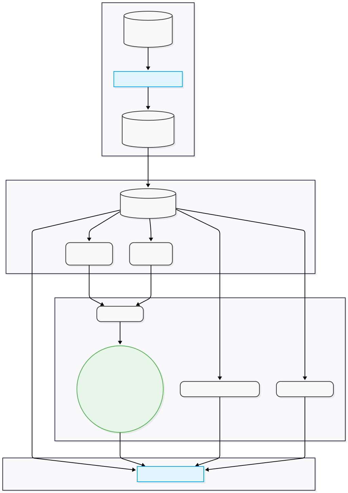

# Customer Intelligence Platform
## From 109M Events to Actionable Business Insights

[](https://www.python.org/)
[](https://duckdb.org/)
[](https://www.pola.rs/)
[](https://streamlit.io/)
[](https://fastapi.tiangolo.com/)

> **An end-to-end analytics platform that processes 109M e-commerce events on a 16GB RAM laptop, no cloud warehouse required. It surfaces high-value customer segments, scores purchase propensity, and quantifies revenue opportunities.**

---

**Live Dashboard:** [](https://customer-intelligence-platform.streamlit.app/)

## Project Overview

The Customer Intelligence Platform takes raw behavioural event logs and turns them into something a business can actually act on. The main constraint I set for myself: everything had to run on a standard laptop, not a cloud cluster.

That required careful data engineering - aggressive type-casting, dictionary encoding for high-cardinality strings, columnar storage, and a proper star-schema model sitting on top of DuckDB. The result is a Streamlit app with executive KPIs, RFM segmentation, a LightGBM purchase propensity model, and a statistical A/B test simulator, plus a FastAPI service that exposes the same segmentation, propensity, recommendation, and A/B testing logic as versioned REST endpoints for programmatic use.

Note that these two consumers are currently independent: the dashboard queries DuckDB directly rather than calling the API, so there's no runtime coupling between them today.

## Problem Statement

**Business challenge**: E-commerce platforms generate huge volumes of event data but rarely have the tooling to answer strategic questions quickly:
- *Which users are showing churn signals?*
- *Who is most likely to purchase next month?*
- *Which products are commonly bought together, and what does that mean for AOV?*

**Technical challenge**: At 100M+ rows, most teams reach for Snowflake, BigQuery, or Spark. Those are valid choices, but they add cost and operational overhead that slow down early-stage analysis.

**Approach**: Modern OLAP engines (DuckDB + Polars) are surprisingly capable on a single machine. This project is a demonstration of how far you can get before you actually need distributed compute.

---

## Data Science & ML Methodology

### 1. Out-of-Time Validation Split

The biggest trap in e-commerce behavioural modelling is leaking future events into training data via random K-fold splits. If a user purchased in November and some of their November sessions end up in the training fold, the model learns the wrong thing.

To avoid this, the propensity model (`src/models/train_propensity.py`) uses a strict temporal split:
- **Features**: Built entirely from October session behaviour — aggregation ratios, RFM flags, checkout density, etc.
- **Target**: Whether the user made a purchase in November.
- **Result**: The 75% ROC-AUC and 4.5x top-5% conversion lift reflect genuine out-of-sample performance, not an artefact of the validation methodology.

### 2. A/B Test Simulation Engine

Correlation is easy to find; knowing whether a segment is worth targeting takes a bit more care. The A/B testing module (`src/analysis/ab_testing.py`) handles:
- **Welch's t-test** (accounts for unequal variances between cohorts, unlike a simple means comparison)
- **Delta method** for 95% confidence intervals on conversion lifts
- **Post-hoc power analysis** to check whether a given cohort size is large enough to reliably detect the minimum effect size you care about

### 3. Market Basket Analysis in Pure SQL

Rather than loading millions of cart events into a Python graph library, association rule mining runs entirely inside DuckDB (`src/models/recommendations.py`). Window functions and self-joins handle product support, co-occurrence counts, confidence, and lift — all on disk. This keeps memory usage flat even across 4.5M purchase events.

---

## System Architecture & Data Pipeline



### 1. Ingestion & Memory Optimisation

- **Raw input**: 12GB CSV, 109M rows, covering Oct–Nov 2019.
- **Optimisation script** (`summarise/optimize_dataset.py`):
    - Uses Polars lazy evaluation (`pl.scan_parquet()`) to process data in streaming chunks rather than loading everything at once — this is what makes it viable on 16GB RAM.
    - Downcasts numeric types (`Int64` -> `Int32` where safe) and replaces high-cardinality UUID strings with integer-keyed dictionaries. A naive Pandas `read_csv()` on this data requires ~120GB of RAM; after type optimisation the in-memory footprint is ~3.7GB — a **97% reduction**.
    - Writes to Parquet with ZSTD level-3 compression: the 14.7GB raw CSV shrinks to **1.9GB on disk** (87% disk reduction), and reads back ~30x faster than CSV.

### 2. Dimensional Modelling & OLAP Layer

- **Database setup** (`scripts/create_cloud_database.py`):
    - Spins up a DuckDB instance configured for sub-second aggregations over 100M+ rows.
    - Structures data as a star schema: fact tables (`fact_sessions`, `fact_daily_kpis`) referencing dimension tables (`dim_users`, `dim_products`).

### 3. Feature Engineering & ML

- **Feature store** (`src/processing/features.py`):
    - Builds user-level features in SQL — session aggregates, checkout density, duration variance, RFM flags — all materialised into a `features_users` table.
- **Propensity model** (`src/models/train_propensity.py`):
    - Trains a LightGBM classifier on October features with November purchases as the target label. The strict out-of-time split (described above) prevents any future data from leaking into training.
    - Achieves **75% ROC-AUC** on the held-out November period; the top 5% of scored users convert at **4.5x the baseline rate**.
- **Recommendations** (`src/models/recommendations.py`):
    - Runs market basket analysis through DuckDB to produce a `predictions_product_affinity` table of cross-sell candidates.

---

## API Service

Alongside the dashboard, `api/` (FastAPI) exposes the same analytics as versioned REST endpoints, backed by a read-only `DuckDBConnectionManager` (`src/db.py`) and a thin service layer (`src/services/`) that wraps the domain logic — no reimplementation of the segmentation/propensity/recommendation/A-B-test code.

| Method | Path | Description |
|---|---|---|
| GET | `/healthz` | Liveness probe |
| GET | `/ready` | Readiness probe — 503 if the DuckDB file or model artifact is missing |
| GET | `/v1/users/{user_id}/segment` | RFM segment for a user |
| GET | `/v1/users/{user_id}/propensity` | LightGBM purchase-propensity score |
| GET | `/v1/products/{product_id}/recommendations` | Market-basket cross-sell recommendations |
| POST | `/v1/experiments/ab-test` | Runs the A/B simulation engine against a named RFM segment |

It also ships rate limiting (`slowapi`), structured JSON request logging (`structlog`, with a per-request `X-Request-ID`), and CORS scoped to the known dashboard origins. There's no authentication layer — treat it as an internal/demo service, not a public API.

**Run it locally:**
```bash
pip install -e ".[api]"
uvicorn api.main:app --reload
# docs at http://localhost:8000/docs
```

**Or via Docker Compose** (builds the sample DuckDB database into the image and serves on port 8000):
```bash
docker compose up --build
```

CI (`.github/workflows/ci.yml`) lints, type-checks, and runs the full test suite (including `tests/api/`) on every push; CD (`.github/workflows/cd.yml`) builds and pushes the image to GHCR and can trigger a Render deploy hook once one is configured.

---

## Results & Business Impact

Analysis across 5.3M users, 15M sessions, and 206K products:

| Finding | Numbers | What to do with it |
|---|---|---|
| **High-intent users are identifiable** | Top 5% of ML-scored users show a 36% purchase probability — **4.5x the population average**. | Run targeted campaigns against this cohort rather than the full list. |
| **At-risk VIPs** | ~36,000 top-decile users ($890 avg spend) showing churn signals. | This segment is small enough for a personalised reactivation flow — the spend data makes them worth prioritising. |
| **Product affinities are strong** | 10M+ product pairs with lift > 1.2 across 4.5M purchase events. | "Frequently bought together" recommendations have a real signal to work from. |

### A couple of interesting findings:
- **Recency dominates history**: Users who browsed within the last 24 hours are **6x more likely** to purchase than those last seen 30 days ago. If you're scoring users for a campaign, recency should carry heavy weight.
- **The funnel break is up top**: Cart-to-purchase is 60.6%, which is solid. The problem is view-to-cart at 10.1% - that's where sessions are dropping off.

---

## Project Structure

```text
customer-intelligence-platform/
├── api/                  # FastAPI service: routers, middleware, logging, exception handlers
│   └── routers/          # health, segments, propensity, recommendations, experiments
├── app/                  # Streamlit application (7 pages)
│   ├── components/       # Shared UI components
│   └── pages/            # Page logic: Data Explorer, ML Engine, etc.
├── config/               # YAML configuration files
├── data/                 # Parquet files and DuckDB database (not checked in)
├── scripts/              # One-off build scripts
│   ├── create_cloud_database.py
│   └── create_sample_dataset.py
├── src/                  # Core analytics, ML, and API-service modules
│   ├── analysis/         # RFM, cohort retention, A/B testing
│   ├── domain/           # Pydantic request/response models for the API
│   ├── ingestion/        # Data loading and schema validation
│   ├── models/           # Propensity model, recommendations
│   ├── processing/       # Sessionisation, feature engineering
│   ├── services/         # Service layer used by the API (segmentation, propensity, etc.)
│   ├── utils/            # Shared helpers
│   ├── config.py         # Pydantic-settings config for the API service
│   └── db.py             # Read-only DuckDB connection manager for the API service
├── summarise/            # ETL scripts for compressing the raw dataset
├── tests/                # Unit, API, and quality-gate tests
├── Dockerfile            # Builds and serves the FastAPI service (port 8000)
├── docker-compose.yml    # Local API container with healthcheck
├── requirements.txt      # Pinned deps for the Streamlit Cloud dashboard
├── pyproject.toml        # Package + optional-dependency groups (api, dashboard, pipeline, dev)
└── readme.md             # This file
```

---

## Installation & Setup

You can run against a small representative sample (fast, works on Streamlit Cloud) or rebuild the full pipeline from the raw 109M-row dataset. The steps below set up the **dashboard**; for the **API service**, see [API Service](#api-service) above — install with `pip install -e ".[api]"` instead of `requirements.txt`.

### 1. Environment Setup

```bash
# Clone the repository
git clone https://github.com/BhargavKumarNath/Customer-Intelligence-Platform.git
cd Customer-Intelligence-Platform

# Create and activate virtual environment
python -m venv .venv

# On Linux/macOS
source .venv/bin/activate
# On Windows
.venv\Scripts\activate

# Install dependencies
pip install -r requirements.txt
```

### 2. Data Pipeline

**Option A: Sample dataset (recommended for exploration)**

Builds a stratified sample that fits within Streamlit Cloud memory limits.
```bash
# 1. Generate the sample Parquet
python scripts/create_sample_dataset.py

# 2. Build the DuckDB database, dimensional models, and RFM segments
python scripts/create_cloud_database.py
```

**Option B: Full dataset**

Download the 12GB CSV from Kaggle and place it in `/data/raw/` first.
```bash
# Run the memory-optimisation pipeline
python summarise/optimize_dataset.py
```

### Rebuilding from Scratch

The large data files (~22GB total) are not checked into Git — they're all reproducible from the public Kaggle source. Here's the full rebuild sequence:

**Files you'll need to regenerate:**

| File | Size | How |
|------|------|-----|
| `data/raw/2019-Oct.csv`, `data/raw/2019-Nov.csv` | ~14 GB | Kaggle download |
| `data/raw/2019-Oct-Nov.parquet` | ~1.8 GB | `summarise/combine_csv_to_parquet.py` |
| `data/raw/ecommerce_optimized.parquet` | ~1.8 GB | `summarise/optimize_dataset.py` |
| `data/db/behavior.duckdb` | ~5.2 GB | `src/ingestion/loader.py` |

```bash
# 1. Download raw CSVs from Kaggle ("Multi-Category E-commerce Events")
#    Place 2019-Oct.csv and 2019-Nov.csv in data/raw/

# 2. Merge the two months into a single Parquet
python summarise/combine_csv_to_parquet.py \
    data/raw/2019-Oct.csv \
    data/raw/2019-Nov.csv \
    data/raw/2019-Oct-Nov.parquet

# 3. Run the memory-optimisation pass (ZSTD compression + type-casting).
#    Note: optimize_dataset.py has hard-coded input/output paths at the bottom
#    of the file. Update them to data/raw/2019-Oct-Nov.parquet ->
#    data/raw/ecommerce_optimized.parquet before running.
python summarise/optimize_dataset.py

# 4. Build the full DuckDB database
#    (reads config/config.yaml for input/output paths)
python src/ingestion/loader.py
```

> The dimensional model, feature store, and ML prediction tables are materialised by the `src/processing/` and `src/models/` pipeline. For the cloud-ready sample, use Option A above.

### 3. Running the Dashboard

```bash
streamlit run app/Home.py
```

---

## Tech Stack

- **Data engineering**: [DuckDB](https://duckdb.org/) (in-process OLAP SQL), [Polars](https://pola.rs/) (Rust-based DataFrame library), [Apache Parquet](https://arrow.apache.org/) (columnar storage)
- **Machine learning**: [LightGBM](https://lightgbm.readthedocs.io/), scikit-learn
- **Dashboard**: [Streamlit](https://streamlit.io/), [Plotly](https://plotly.com/)
- **API service**: [FastAPI](https://fastapi.tiangolo.com/) + Uvicorn, `slowapi` (rate limiting), `structlog` (structured logging), Pydantic v2
- **Deployment**: Docker, GitHub Actions (CI: lint/type-check/test; CD: build + push to GHCR, optional Render deploy hook)
- **Architecture**: Star schema dimensional model, config-driven pipeline

---

## Limitations & What's Next

1. **Causal inference**: The current A/B simulation assumes correlation implies causation. Integrating `DoWhy` or `EconML` would let you estimate true incrementality from the intervention.
2. **Graph-based recommendations**: The SQL approach works well for pairwise affinities, but moving to `Neo4j` would unlock multi-hop relationships (PageRank, Node2Vec embeddings).
3. **Streaming ingestion**: Single-user scoring is already available in real time via the FastAPI service, but the underlying pipeline is still batch-only. Connecting Kafka to DuckDB for intra-day event streaming would keep segments and propensity scores fresh without a full pipeline rerun.
4. **Wiring the dashboard to the API**: The Streamlit app and the FastAPI service currently query DuckDB independently rather than the dashboard calling the API. Consolidating onto one code path would remove the duplication.
5. **API auth**: The service currently has no authentication layer, so it's suitable for internal/demo use but not for a public deployment as-is.

---

**If this helped with your data engineering work, a star on the repo goes a long way!**

*Questions or collaborations? Open an issue or reach out on [LinkedIn](https://www.linkedin.com/in/bhargavkumarnath/).*
